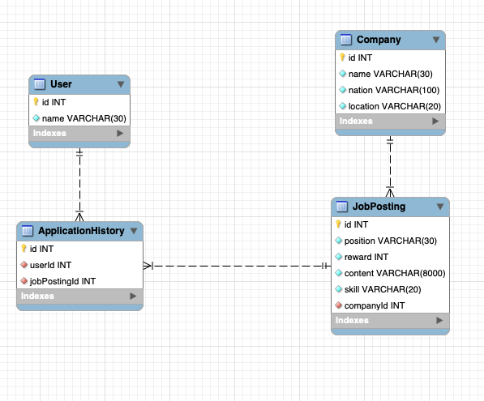

## ✨원티드 프리온보딩 백엔드 인턴십 사전 과제✨

#### 목차
1. [개인 정보](#1-지원자-성명--김민지)
2. [어플리케이션 정보](#2-어플리케이션-정보)
3. [어플리케이션 실행 방법](#3-어플리케이션-실행-방법)
4. [요구사항 분석](#4-요구사항-분석)
5. [구현 과정 설명](#5-구현-과정-설명)
6. [API 명세](#6-api-명세)
7. [Unit Test](#7-unit-test)

<hr/>

### 1. 지원자 성명 : 김민지
### 1-1. 구현한 API의 동작을 촬영한 데모 영상 링크
[데모영상](https://drive.google.com/file/d/1stKmUWb7my5O_eu-liFdGXv3wdGOHmA_/view)

<hr/>

### 2. 어플리케이션 정보
##### 1. swagger 참고
http://localhost:8000/api-docs

##### 2. 기술 스택
- Node.js
- Nest.js
- TypeScript
- MySQL
- TypeORM
- Jest

##### 3. ERD


<hr/>

### 3. 어플리케이션 실행 방법
1. docker 환경이 반드시 셋팅되어 있어야 합니다.
    - 참고 :https://hub.docker.com/
2. git clone
    ```
    git clone https://github.com/minjispace/wanted-pre-onboarding-backend
    ```
3. .env 파일 생성
    ```
    touch .env
    ```
4. .env 파일 구성 예제
    ```
    NODE_ENV=dev
    PORT = 8000

    DB_HOST=localhost
    DB_PORT=3308
    DB_USERNAME=root
    DB_PASSWORD=password
    DB_NAME=wanted
    ```
5. docker compose 파일 up 시켜서 mysql 서버 생성해서 연결
    ```
    docker compose up -d
    ```
6. 서버 시작 시키기
    ```
    yarn & yarn start:dev
            or
    npm i & npm run start:dev
    ```    
<hr/>

### 4. 요구사항 분석
##### 1. 채용 공고 관리 요구사항
- **채용 공고 등록**: 
    - 사용자는 채용 공고를 등록할 수 있어야 합니다. 
    - 채용 공고는 제목, 내용, 포지션, 보상, 기술 스킬 등의 정보를 포함해야 합니다.

- **채용 공고 수정**: 
    - 사용자는 등록한 채용 공고를 수정할 수 있어야 합니다. 
    - 수정 가능한 정보는 제목, 내용, 포지션, 보상, 기술 스킬 등입니다.
- **채용 공고 삭제**: 
    - 사용자는 등록한 채용 공고를 삭제할 수 있어야 합니다.

- **채용 공고 목록 조회**:
    -  모든 사용자는 등록된 채용 공고의 목록을 조회할 수 있어야 합니다. 
    - 이 목록에는 제목, 회사 이름, 위치, 포지션, 보상, 기술 스킬 등의 정보가 포함되어야 합니다.

- **채용 공고 상세 조회**: 
    - 사용자는 특정 채용 공고의 상세 정보를 조회할 수 있어야 합니다. 
    - 이 상세 정보에는 채용 공고의 모든 정보와 해당 회사의 다른 채용 공고 목록이 포함되어야 합니다.

- **채용 공고 검색**: 
    - 사용자는 특정 키워드로 채용 공고를 검색할 수 있어야 합니다. 
    검색은 채용 공고의 제목, 회사 이름, 위치, 포지션, 보상, 기술 스킬 등에서 이루어져야 합니다.

##### 2. 사용자 동작
- 사용자는 채용 공고를 등록하고 수정할 수 있어야 합니다. 
- 사용자는 등록한 채용 공고를 삭제할 수 있어야 합니다. 
- 그리고 다른 채용 공고도 확인하고 검색할 수 있어야 합니다.
- 또한, 특정 키워드로 채용 공고를 검색하여 관심있는 공고를 찾을 수 있어야 합니다.
<hr/>

### 5. 구현 과정 설명
##### 1. application_history ( 지원내역 )
- **role** : application_history 폴더는 채용 공고에 대한 지원 내역을 관리
- **entity** : ApplicationHistory entity를 정의하고 관련 로직을 구현
- **table 구성** : application history id, 지원한 user, 지원한 
job_posting
- **unit test** : 지원 내역과 관련된 비즈니스 로직을 단위 테스트하는 코드, 이를 통해 지원 내역과 관련된 로직의 정확성을 검증

##### 2. company ( 회사 )
- **role** : company 폴더는 회사(기업) 정보를 관리
- **entity** : Company entity 정의, 관련 로직을 구현 
- **table 구성** : company id, name, nation, location, postings
- **seed data** : 초기 회사 데이터를 생성하는데 사용되는 seed로직 seed 폴더에 구성

##### 3. job_posting ( 채용 공고 )
- **role** : 채용 공고를 관리
- **entity** : JobPosting 엔티티를 정의하고 관련 로직을 구현, 채용 공고에 대한 정보를 저장
- **table 구성** : job_posting id, position, reward, content, skill, 채용공고를 올린 company ,해당 채용공고 지원내역을 나타내는 applicationLists


##### 4. search ( 채용공고 검색 )
- **role** : 채용 공고를 검색하기 위한 서비스를 관리
- **search service** : JobPostingSearchService와 같이 검색 서비스를 구현하고 해당 서비스를 활용하여 채용 공고를 검색하는 로직을 구현
- **unit test** : 검색과 관련된 비즈니스 로직을 단위 테스트하는 코드도, 이를 통해 검색 기능의 정확성과 신뢰성을 확인

##### 5. seed ( company, user seed data )
- **role** : 초기 데이터를 생성하는 데 사용되는 시드(seed) 로직을 관리
- **seed service** : 초기 company 데이터나 user 데이터를 생성하고 데이터베이스에 적재하는 로직을 구현
- **unit test** : 시드(seed) 데이터 생성과 관련된 비즈니스 로직을 단위 테스트하는 코드,  이를 통해 시드 데이터가 정확하게 생성되고 적재되는지 확인


##### 6. user ( 사용자)
- **role** : 사용자 정보를 관리
- **entity** : User 엔티티를 정의하고 관련 로직을 구현 ,사용자에 대한 정보를 저장
- **table 구성** : user id, name, 유저가 지원한 채용공고내역을 가리키는 applicationHistory

 
<hr/>

### 6. API 명세
#### 1. **JobPosting**
1. **채용공고 등록**
    - **end point**
      ```
        POST /api/v1/posting
        ```
     - **Request Body (required)**
        ```
        {
            "position": "백엔드 주니어 개발자",
            "reward": 1000000,
            "content": "원티드랩에서 백엔드 주니어 개발자를 채용합니다. 자격요건은..",
            "skill": "Nest.js",
            "company": 2
        }
        ```       
     - **Success Response**
        - 201 Created   
        ```
        {
            "newposting": {
                "position": "백엔드 주니어 개발자",
                "reward": 1000000,
                "content": "원티드랩에서 백엔드 주니어 개발자를 채용합니다.     자격요건은..",
                "skill": "Nest.js",
                "company": 2,
                "id": 6
            }
        }
        ```
    - **Bad Request**
        - 400 Bad Request
        ```
        {
            "statusCode": 400,
            "message": "Invalid user or job posting",
            "error": "Bad Request"
        }
        ```
        <hr/>
2. **채용공고 목록 조회**
    - **end point**
      ```
        GET /api/v1/posting
        ```      
     - **Success Response**
        - 200 OK
        ```
        {
            "job_posting_id": 1,
            "company_name": "원티드랩",
            "company_nation": "한국",
            "company_location": "서울",
            "job_position": "백엔드 주니어 개발자",
            "job_reward": 1500000,
            "job_skill": "Nest.js"
        }
        ```
        <hr/>
3. **채용공고 수정**
    - **end point**
      ```
        PATCH /api/v1/posting/{id}
        ```
    - **parameter (required)**
        job_posting id 필수

    - **Request Body (required)**
        ```
        {
            "position": "백엔드 주니어 개발자",
            "reward": 1500000,
            "content": "원티드랩에서 백엔드 주니어 개발자를 '적극' 채용합니다.자격요건은..",
            "skill": "Nest.js"
        }
        ```       
     - **Success Response**
        - 200 OK
        ```
        {
            "position": "백엔드 주니어 개발자",
            "reward": 1500000,
            "content": "원티드랩에서 백엔드 주니어 개발자를 '적극' 채용합니다.자격요건은..",
            "skill": "Nest.js"
        }
        ```
    - **Bad Request**
        - 400 Bad Request
        ```
        {
            "statusCode": 400,
            "message": "Invalid user or job posting",
            "error": "Bad Request"
        }
        ```
        <hr/>
4. **채용공고 삭제**
    - **end point**
      ```
        DELETE /api/v1/posting/{id}
      ```    
    - **parameter (required)**
        job_posting id 필수

     - **Success Response**
        - 204 No Content

    - **Bad Request**
        - 400 Bad Request
        ```
        {
            "statusCode": 400,
            "message": "Invalid user or job posting",
            "error": "Bad Request"
        }
        ```
        <hr/>
5. **채용공고 상세페이지 조회**
    - **end point**
      ```
        GET /api/v1/posting/{id}
        ```     
    - **parameter (required)**
        job_posting id 필수

     - **Success Response**
        - 200 OK
        ```
        {
            "job_posting_id": 1,
            "company_name": "원티드랩",
            "company_nation": "한국",
            "company_location": "서울",
            "job_position": "백엔드 주니어 개발자",
            "job_reward": 1500000,
            "job_skill": "Nest.js",
            "job_content": "원티드랩에서 백엔드 주니어 개발자를 채용합니다. 자격요건은..",
            "job_other_postings_by_company": [1, 2, 3]
        }
        ```
    - **Bad Request**
        - 400 Bad Request
        ```
        {
            "statusCode": 400,
            "message": "Invalid user or job posting",
            "error": "Bad Request"
        }
        ```
        <hr/>
6. **채용공고 검색**
     - **end point**
        ```
        GET /api/v1
        ```  
    - **query parameter**
       search: 검색어를 지정하여 채용 공고를 검색합니다.
       http://localhost:8000/api/v1/search=?

     - **Success Response**
        - 200 OK   
        ```
        [
            {
              "job_posting_id": 1,
              "company_name": "원티드랩",
              "company_nation": "한국",
              "company_location": "서울",
              "job_position": "backend",
              "job_reward": 10000,
              "job_skill": "next.js"
            },
            {
              "job_posting_id": 2,
              "company_name": "원티드랩",
              "company_nation": "한국",
              "company_location": "서울",
              "job_position": "backend",
              "job_reward": 10000,
              "job_skill": "next.js"
            },
            {
              "job_posting_id": 3,
              "company_name": "원티드랩",
              "company_nation": "한국",
              "company_location": "서울",
              "job_position": "백엔드 주니어 개발자",
              "job_reward": 1000000,
              "job_skill": "Nest.js"
            }
        ]
        ```
7. **채용공고 지원내역**
    - **end point**
      ```
        POST /api/v1/application-history 
        ```
     - **Request Body (required)**
        ```
        {
            "user": 1,
            "job_posting": 1
        }
        ```       
     - **Success Response**
        - 201 Created   
        ```
        {
            "user": 1,
            "job_posting": 1
        }
        ```
    - **Bad Request**
        - 400 Bad Request
        ```
        {
            "statusCode": 400,
            "message": "Invalid user or job posting",
            "error": "Bad Request"
        }
        ```

    - **Forbidden**
        - 403 Forbidden
        ```
        {
            "statusCode": 403,
            "message": "You have already applied to this posting before",
            "error": "Forbidden"
        }
        ```
8. **유저**
    - **end point**
      ```
        GET /api/v1/user
        ```
    - **Success Response**
        - 200 OK
        ```
        {
            "id": 1,
            "name": "김민지"
        }
        ```
9. **회사**
     - **end point**
      ```
        GET /api/v1/company
      ```
    - **Success Response**
        - 200 OK
        ```
        {
            "id": 1,
            "name": "원티드랩",
            "nation": "한국",
            "location": "서울"
        }
        ```
<hr/>

### 7. Unit Test
- service test coverage 100& 완료
- 각각의 repository를 mocking 하여 테스트 진행
- API Docs에 작성된 것 모두 테스트 진행 완료

```
--------------|---------|----------|---------|---------|-------------------
File          | % Stmts | % Branch | % Funcs | % Lines | Uncovered Line #s 
--------------|---------|----------|---------|---------|-------------------
All files     |   35.44 |    46.66 |    37.5 |   35.78 |                   
src           |       0 |        0 |       0 |       0 |         
...                   
application   |   52.54 |       50 |      25 |   57.44 |                           
   entity     |   69.23 |      100 |       0 |     100 |                      
   service    |   91.66 |       50 |     100 |    90.9 |  
...                      
company       |      40 |      100 |       0 |   47.05 |                               
   entity     |   83.33 |      100 |       0 |     100 |      
...                         
job posting   |   58.02 |    83.33 |   41.17 |   60.56 |                           
   entity     |   76.47 |      100 |       0 |   84.61 |                     
   service    |     100 |    83.33 |     100 |     100 |  
...                        
search        |   35.71 |      100 |      50 |   36.36 |                              
   service    |     100 |      100 |     100 |     100 |          
...
seed          |   66.66 |      100 |     100 |      70 |                                
   service    |     100 |      100 |     100 |     100 |        
...           
user          |   34.78 |      100 |       0 |   35.29 |                             
   entity     |      80 |      100 |       0 |      75 |   
...                       
utils         |     100 |      100 |     100 |     100 |                   
   seed-data  |     100 |      100 |     100 |     100 |                   
--------------|---------|----------|---------|---------|-------------------
```
1. **job_posting.service.spec.ts 단위 테스트**
    - 채용공고 작성
        - 채용공고 작성 성공
        - 채용공고 작성 실패 
    - 채용공고 수정
        - 채용공고 수정 성공
        - 채용공고 수정 실패 
    - 채용공고 삭제
        - 채용공고 삭제 성공
        - 채용공고 삭제 실패
    - 채용공고 조회
        채용공고 목록 조회 성공
        채용공고 상세 조회 성공
        채용공고 상세 조회 실패
2. **search.service.spec.ts 단위 테스트**
    - 채용공고 검색
        - 채용공고 검색 성공 결과값
        - 채용공고 검색 성공 빈값 


3. **application_history.service.spec.ts 단위 테스트**
    - 채용공고 지원
        - 채용공고 지원 성공
        - 채용공고 지원 실패 Bad Request
        - 채용공고 지원 실패 이미 지원한 채용공고면 Forbidden

4. **seed.service.spec.ts 단위 테스트**
    - company, user 첫 데이터 불러오기
        - 데이터 불러오기 성공

